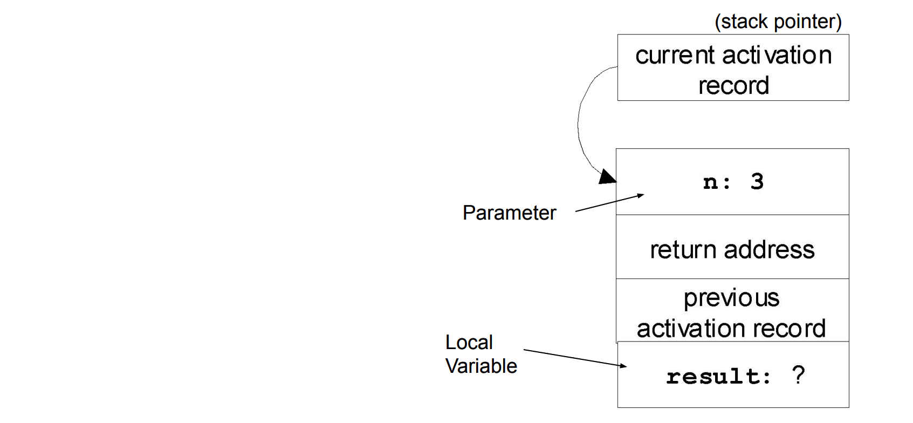

# Week 7: Memory & Java

This file connects Java programs to how they run in **memory**.

---

## Variables and Memory

Every variable in Java is stored in a **memory location**.

The language system keeps track of this by binding variables to memory.

Types of variables include:
- Global variables
- Parameters
- Local variables
- Object (member) variables

---

## Activation Records (Function Calls)

When a method is called, Java creates an **activation record**.

This stores:
- parameters
- local variables
- return address
 These are stored on the **runtime stack**

---

## The Runtime Stack

Each function call adds a new frame:

- One call → one activation record  
- Recursive calls → multiple stacked records  

Java uses a **stack of activation records**, not just one

---

## Example: Recursion (Factorial)

```java
int fact(int n) {
    int result;
    if (n < 2) result = 1;
    else result = n * fact(n - 1);
    return result;
}
```




When calling `fact(3)`:
- Each call creates a new activation record
- Values are stored separately for each call

This is why recursion works correctly

---

## Memory Layout

A typical Java program uses:

- **Static memory** → global data, compiled code  
- **Stack** → function calls (activation records)  
- **Heap** → dynamically created objects

---

## Heap Memory

Objects created with `new` go on the heap:

```java
Object o = new Object();
```

Java automatically manages memory using **garbage collection**.

Memory is freed when it is no longer referenced

---

## Comparison to C

- Java → automatic memory management (safe)
- C → manual memory management (error-prone)

Common issues in C:
- memory leaks
- dangling pointers

---

## Key Takeaways

- Variables map to memory locations
- Method calls create activation records on the stack
- Objects live on the heap
- Java automatically manages memory
